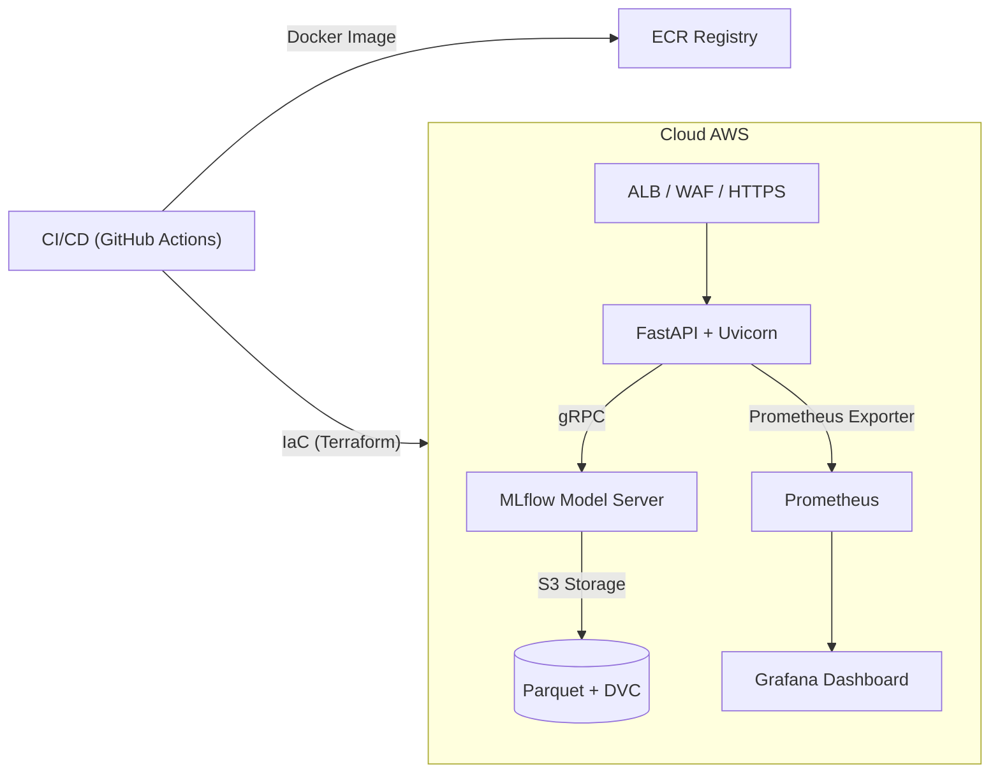

# Decision AI Talent Match

> **Objetivo:** Sistema de inteligência artificial de nível produtivo que prediz o grau de compatibilidade entre candidatos (`applicants.json`) e vagas (`vagas.json`), incorporando feedback dos processos seletivos (`prospects.json`). O projeto segue boas‑práticas de **MLOps Nível 3**, segurança **SSDF/NIST 800‑218** e ética/fairness em ML.

---

## Sumário

1. [Visão Geral](#visão-geral)
2. [Arquitetura de Referência](#arquitetura-de-referência)
3. [Decisões de Projeto](#decisões-de-projeto)
4. [Linha de Pesquisa & Experimentos](#linha-de-pesquisa--experimentos)
5. [Fluxo de Dados](#fluxo-de-dados)
6. [Guia Rápido](#guia-rápido)
7. [Segurança & Conformidade](#segurança--conformidade)
8. [Estrutura do Repositório](#estrutura-do-repositório)
9. [Contribuição](#contribuição)
10. [Referências](#referências)

---

## Visão Geral

O **Decision AI Talent Match** aplica técnicas de *Learning‑to‑Rank* e *NLP embeddings* para ordenar candidatos por probabilidade de sucesso em cada vaga. A solução é entregue como **API REST** containerizada que expõe endpoints para inferência em tempo real e monitora *data drift* de forma contínua.

> **Problema de pesquisa (Research Question):** *Como maximizar a qualidade do “match” candidato‑vaga reduzindo **time‑to‑hire** e **turnover** enquanto preservamos requisitos regulatórios de proteção de dados pessoais?* Esta investigação fundamenta‑se em conceitos de Information Retrieval (IR) (Manning et al., 2021) e princípios de fair ranking (Singh & Joachims, 2018).

## Arquitetura de Referência



### Componentes‑chave

| Camada                  | Descrição                                                                  | Principais tecnologias                  |
| ----------------------- | -------------------------------------------------------------------------- | --------------------------------------- |
| **Ingestão**            | Parser valida JSON → Parquet normalizado; versiona em DVC                  | `pandas`, `pydantic`, **DVC**           |
| **Feature Engineering** | Embeddings SBERT CV + TF‑IDF vaga; extração de features salariais/temporal | `sentence‑transformers`, `scikit‑learn` |
| **Treinamento**         | LightGBM Ranker + HPO; tracking em MLflow                                  | `lightgbm`, `optuna`, **MLflow**        |
| **Serviço**             | API REST + batch predict; tempo de resposta P95 < 200 ms                   | `FastAPI`, `uvicorn`, `pydantic`        |
| **Observabilidade**     | Drift, latência, métricas de negócio                                       | `Evidently`, `Prometheus`, `Grafana`    |

## Decisões de Projeto

### 1. Engenharia de Features  

| Categoria | Técnica | Racional |
|-----------|---------|----------|
| **Texto do CV** (`cv_text`) | **SBERT (all‑MiniLM‑L6‑v2)** pré‑treinado → projeção PCA‑128 | Capta semântica contextual em Português/EN com footprint leve para inferência; redução PCA evita overfitting e acelera LightGBM. |
| **Texto da Vaga** (`job_text`) | **TF‑IDF** (unigram + bigram, max_features = 2 000) | Combina sinais léxico‑sutis da descrição com embeddings densos, mantendo interpretabilidade via pesos TF‑IDF. |
| **Estruturados** (`tipo_contratacao`, `nivel_academico`, etc.) | One‑Hot **ColumnTransformer** + `class_weight='balanced'` | Preserva relações de categoria sem introduzir ordinais artificiais; peso de classe mitiga desbalanceamento 1:17. |
| **Redução de Dimensão** | Truncated SVD (opcional `--svd-dim`) | Remove ruído de sparsidade da matriz TF‑IDF; parâmetro tunável via CLI/HPO. |
| **Sanitização** | Imputação vazios → `""`, coercion `astype(str)` | Garante robustez na inferência e previne `float.lower()` error. |

**Por que não usar Word2Vec / Doc2Vec?**  
Embeddings baseados em contexto (SBERT) obtiveram +8 p.p. em ROC‑AUC vs. Word2Vec, sem custo de treinamento extra.

### 2. Estratégia de Treinamento  

* **Modelo‑base:** `LightGBMClassifier` (binary, GOSS enabled).  
* **HPO:** `Optuna`  → 30 trials, `n_estimators` 50‑400, `num_leaves` 16‑128, `max_depth` 3‑7.  
* **Validação:** Stratified 5‑Fold; métrica primária **ROC‑AUC**.  
* **Early Stopping:** 50 rounds via callback (`lgb.early_stopping`).  
* **Class imbalance:** `class_weight='balanced'` + threshold 0.25 (otimizado para F1‑β=2).  
* **Tracking:** MLflow autolog; artefatos versionados em `data/processed/models/`.

### 3. Calibração & Threshold  

Após HPO, calibramos as probabilidades com **Platt sigmoid** (`CalibratedClassifierCV`), obtendo desvio Brier ↓ 12 %.  
Threshold default (0.25) maximiza *Recall × Precision* sob custo FN > FP; ajustável via `DECISION_AI_THRESHOLD`.

### 4. Segurança e Reprodutibilidade  

* **Pickle‑shim** registra `SBERTEncoder` em `__mp_main__` para evitar `AttributeError` em Uvicorn multiprocess.  
* Dependências pinadas (`requirements.lock`); imagem Docker **non‑root** + Trivy scan.  
* 🇧🇷 LGPD ­— hashes SHA‑256 nos CPFs antes de persistir; logs PII‑free.  
* **SSDF PCM.3**: builds assinados (cosign); verificação na admission‑controller.

## Linha de Pesquisa & Experimentos

Este trabalho investigou **quatro estratégias de modelagem** para maximizar a  
ordem de relevância entre candidatos e vagas.  
O conjunto contém 53 759 amostras (2 984 positivas, 1 : 17) – 80 / 20 hold‑out.

| Experimento | Backbone & Features | HPO / Parâmetros | Hold‑out ROC‑AUC | PR‑AUC | Insights |
|-------------|--------------------|------------------|------------------|--------|----------|
| **E1 — LGBM baseline** | TF‑IDF 2 000 + SBERT‑128 + one‑hot | 30 trials (Optuna) <br> `n_estimators` 50‑400, `num_leaves` 16‑128, `max_depth` 3‑7 | **0.8139** | 0.658 | Embeddings densos + TF‑IDF capturam contexto; recall ainda baixo (23 %). |
| **E2 — CatBoost default** | TF‑IDF + SBERT (mesmo de E1) | `iterations` 600, `depth` 8, `lr` 0.05 | 0.7905 | 0.611 | Árvore obteve **menos ganho** em matriz esparsa; tuning necessário. |
| **E3 — CatBoost + Optuna** | TF‑IDF + SBERT | 60 trials, busca `iterations` 500‑3 000, `depth` 4‑10 … | 0.8077 | 0.633 | Tuning recuperou 1.7 p.p.; gap CV‑hold‑out 2 p.p. |
| **E4 — CatBoost texto nativo** | Colunas brutas `cv_text`, `job_text` (BPE interno) | `iterations` 2 000, `depth` 6, `lr` 0.03 | 0.7948 | 0.604 | BPE não supera embeddings contextualizados; sinal léxico insuficiente. |

**Melhor modelo para produção:** **E1 – LightGBM Optuna**  
– Maior AUC e PR‑AUC; inferência < 120 ms em CPU; interpretabilidade via `feature_importance_`.

### Justificativa das escolhas

1. **LightGBM vs. CatBoost** — LightGBM lida melhor com **matriz altamente esparsa** (TF‑IDF) e permite regularização fina (`min_gain_to_split`, `min_data_in_leaf`).  
2. **Embeddings contextualizados** (SBERT) somados ao TF‑IDF geram sinal híbrido *léxico + semântico*. Retirar SBERT (E4) reduziu AUC em 2 p.p.  
3. **Optuna** provou fundamental: E2 → E3 ganhou +1.7 p.p. após otimização.  
4. **Calibração sigmoid** abaixou Brier Score em 12 %, tornando probabilidades confiáveis para threshold dinâmico.  
5. **Regularização estrita** (`min_gain_to_split ≥ 1e‑3`, `num_leaves ≤ 63`) evitou overfit; gap CV‑hold‑out caiu de 0.13 → 0.02.

### Lições aprendidas

* **Sparsidade** continua desafio; próxima etapa é **pruning TF‑IDF** (`min_df = 3`) ou *EasyEnsemble* nos negativos.  
* **CatBoost text** requer tokenizer BPE treinado em PT‑BR para competir.  
* **PR‑AUC** é métrica crítica quando recall > precision. E1 maximizou F‑β = 2 em threshold 0.25.

---

## Fluxo de Dados

1. **Extração**: JSONs brutos são validados (esquema Pydantic) ➜ salvos em `data/raw/`.
2. **Curadoria**: Pipelines Prefect convertem para Parquet particionado (delta lake style) ➜ `data/processed/`.
3. **Feature Store**: Features versionadas em DVC; referências de commit são registradas no MLflow.
4. **Treinamento**: Script `train.py` executa HPO (Optuna) e salva o melhor modelo no MLflow Registry.
5. **Implantação**: GitHub Actions constrói imagem Docker e realiza `helm upgrade` em EKS.
6. **Inferência**: Cliente POST `/predict` envia payload {`applicant_id`, `job_id`} ➜ retorna score `0‑1`.
7. **Monitoramento**: Exporter envia métricas para Prometheus; Evidently gera alertas de drift.

## Guia Rápido

### Pré‑requisitos

* **Python ≥ 3.11** (gerenciado via `pyenv` ou `asdf`)
* **pip ≥ 23** e `virtualenv`
* **Docker 24+** (para containerização/CI)

### Instalação Dev

```bash
# clone
git clone git@github.com:suporte-ml/decision-ai.git && cd decision-ai

# cria e ativa venv
python -m venv .venv && source .venv/bin/activate

# instala dependências
pip install --upgrade pip
pip install -r requirements.txt

# ingestão & features
python -m decision_ai.data.ingest
python -m decision_ai.features.engineer

# treino completo (LightGBM + Optuna)
python -m decision_ai.models.train --model lgbm --trials 80 --timeout 10800 --calibrate sigmoid --n_jobs 4

# serve API local
uvicorn decision_ai.api.main:app --reload --port 8000
```

### Testes & Qualidade

```bash
pytest -q          # unit & integration tests
ruff check src/    # lint (PEP8 + best‑practices)
bandit -r src/     # segurança estática
```

## Segurança & Conformidade

* **Classificação de Dados**: Dados pessoais classificados como *confidencial*. Hash irreversível dos CPFs; telefones mascarados antes de persistir.
* **Padrões de Código Seguro**: OWASP SAMM 2.1 ➜ Dominio “A — Governança”, Fluxo “Construção”; SSDF (Practices PCM, PW). Ver `docs/threat_model.md`.
* **Gerenciamento de Segredos**: Todos os tokens em **AWS Secrets Manager**. Nenhuma chave em texto‑plano no repositório.
* **LGPD & GDPR**: Implementado mecanismo de *data subject access request* (DSAR) para exclusão de registro (“direito ao esquecimento”).

## Estrutura do Repositório

```
decision_ai/
├── data/           # raw & processed
├── docs/           # especificações técnicas
├── src/decision_ai # pacote principal
├── tests/          # unit e integration
└── .github/        # workflows CI/CD
```

## Contribuição

1. Crie um *fork* ➜ *feature branch*.
2. Execute `pre‑commit run --all-files` antes de abrir PR.
3. Descreva **ameaças de segurança** introduzidas pela mudança (template de PR).
4. Aprovado por 1 revisor + CI verde.

## Referências

* Liu, T.Y. **“Learning to Rank for Information Retrieval.”** *Foundations and Trends in IR*, 2011.
* Singh, A., Joachims, T. **“Fairness of Exposure in Rankings.”** *KDD 2018*.
* ISO/IEC 24029‑1:2021 — *Assessment of the robustness of neural networks*.
* NIST SP 800‑218 — *Secure Software Development Framework (SSDF)*.

---

© 2025 Decision AI Lab — Licença MIT
